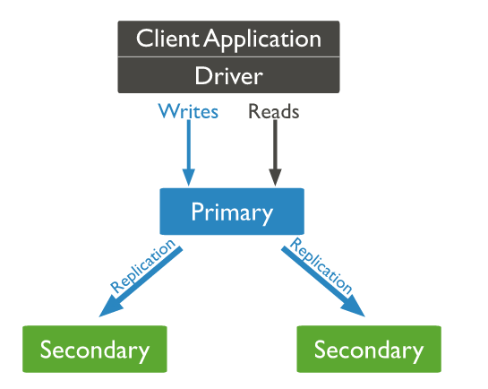
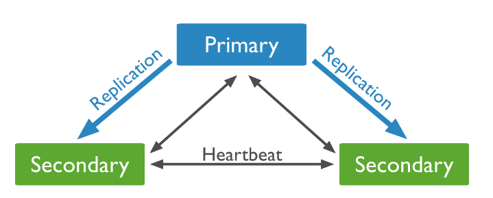
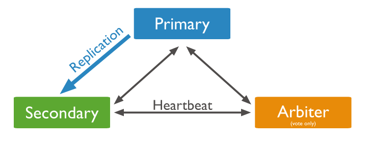
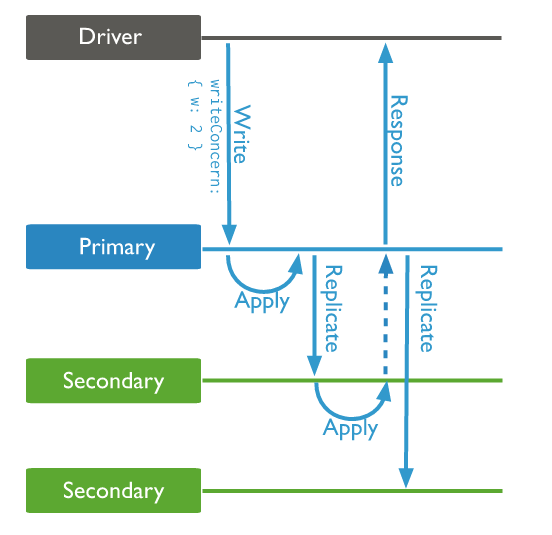

# 一，MongoDB复制集 #
MongoDB复制是将数据同步在多个服务器的过程。

复制提供了数据的冗余备份，并在多个服务器上存储数据副本，提高了数据的可用性， 并可以保证数据的安全性。

复制还允许你从硬件故障和服务中断中恢复数据。

复制集：

 - 保障数据的安全性
 - 数据高可用性 (24*7)
 - 灾难恢复
 - 无需停机维护（如备份，重建索引，压缩）
 - 分布式读取数据

# 二，MongoDB原理 #
mongodb的复制至少需要两个节点。其中一个是主节点，负责处理客户端请求，其余的都是从节点，负责复制主节点上的数据。

mongodb各个节点常见的搭配方式为：一主一从、一主多从。

主节点记录在其上的所有操作oplog，从节点定期轮询主节点获取这些操作，然后对自己的数据副本执行这些操作，从而保证从节点的数据与主节点一致。

MongoDB复制结构图如下所示：

以上结构图中，客户端从主节点读取数据，在客户端写入数据到主节点时， 主节点与从节点进行数据交互保障数据的一致性。

特点：

 - N 个节点的集群
 - 任何节点可作为主节点
 - 所有写入操作都在主节点上
 - 自动故障转移
 - 自动恢复

# 三，MongoDB原理 #

主节点（primary）：负责数据的读写，将数据同步到从节点，并参与投票。

从节点（secondary）：负责从主节点同步数据，参与投票。

仲裁者节点（arbiter）：只负责参与投票，不同步数据。

一个复制集至少需要三个节点，常见的两种复制集形式为一主两从或一主一从一仲裁。

一主两从：

一主一从一仲裁：

自动故障转移：当主节点发生故障时，剩下的节点能够通过选举，选举出新的主节点。

# 四，读参考（Read Preference） #
读参考是指MongoDB将客户端的读请求路由到复制集中指定的成员上，默认情况下读操作的请求被路由到复制集的primary节点上。从primary节点上进行读取能够保证读到的数据是最新的，但是将读操作路由到其他secondary节点上去后，由于从primary节点同步数据到secondary节点会产生时间差，可能导致从secondary节点上读到的数据不是最新的。当然这对于实时性要求不是很高的绝大部分应用程序来说，并不是大问题。

因为每一个secondary节点都会从primary节点同步数据，所有secondary节点一般有相同的写操作流量，同时primary节点上的用于同步数据的读操作量也并没有减少。

它最大的好处是能够使客户端的读请求路由到最佳的secondary节点上（如最近的节点），提高客户端的读效率，并且一定程度上实现读写分离。

# 五，写关注（Write Concern） #
对于某些应用程序来说，写关注是重要的。它能判断哪些写操作成功写入了，哪些失败了。对于失败的操作，驱动程序能返回错误，由应用程序决定怎么处理。如果没有写关注，应用程序发送一个写操作到socket后，就不会管后面发生了什么情况，不知道是否成功写入数据库，这种情形对于日志类型的应用程序还是可以接受的，因为偶尔的写失败不会影响整个日志的监控情况。带有写关注的操作会等到数据库确认成功写入后才能返回，因此写关注会带来一点性能的损失。

    db.products.insert(
       { item: "envelopes", qty : 100, type: "Clasp" },
       { writeConcern: { w: 2, wtimeout: 5000 } }
    )

w为2表示写关注将针对复制集中的2个节点，当MongoDB收到这些节点的反馈信息后，命令才返回给客户端继续执行。

wtimeout表示超时时间，指定写关注应在多长时间内返归，如果你没有指定这个值，复制集可能因为不确定因素导致应用程序的写操作一直阻塞。

# 六，结合校招 #
MongoDB复制集主要是用于高可用，读参考可用于读写分离，但是目前校招有自己的定时备份机制，加上校招的访问量和并发量不高，只有一台服务器，所以可能并不适合使用复制集。

当然，有兴趣可以学习下MongoDB的复制集，扩展知识面。