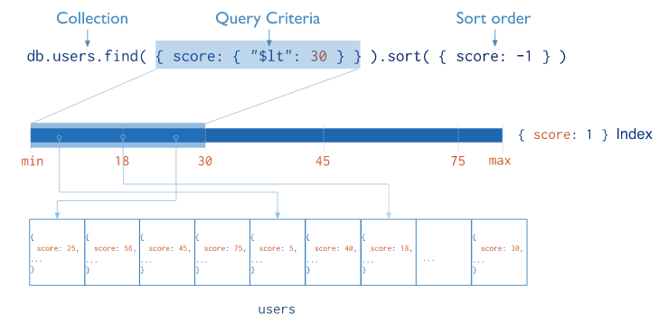
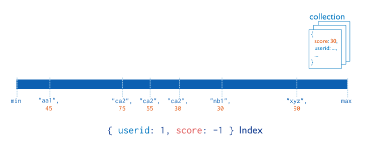
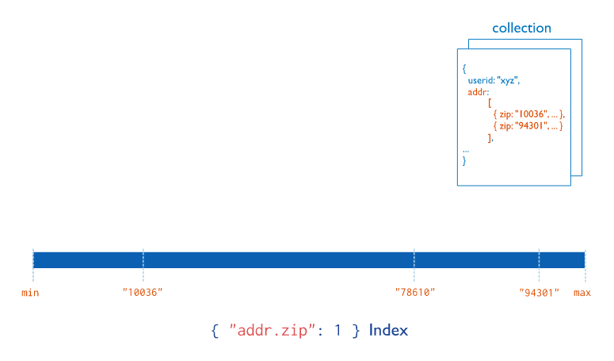

# 一，MongoDB索引与集合 #
在MongoDB中，索引可以支持更加高效的查询操作。如果没有索引，每一次查询都是全表扫描搜索，效率低下。

基本上，MongoDB的索引概念跟其他关系型数据库相似。

**本文只对MongoDB相关索引进行介绍，至于相对应的使用方法，可以在附带的官网链接上找到或者自己上网查找相关资料，此处不再赘述。**

学习资料：

 - MongoDB官网：https://www.mongodb.com/ 
 - MongoDB官方教程：https://docs.mongodb.com/tutorials/ 
 - MongoDB中文社区：http://www.mongoing.com/ 
 - MongoDB官方文档：https://docs.mongodb.com/manual/ 
 - 中文社区对官方文档的翻译（以如觉有异常，以官方英文版文档为准）：http://docs.mongoing.com/manual-zh/index.html
 - 《MongoDB权威指南》（可在公司图书馆借阅）
 - 《大数据存储 MongoDB实战指南》（可在公司图书馆借阅）

# 二，索引介绍 #
## 1，默认索引 ##
MongoDB中存储的文档必须有一个`_id`键。这个键的值可以是任何类型的，默认是个ObjectId对象。

默认情况下，MongoDB会在`_id`字段上集合上创建一个唯一索引（Unique Indexes）。

ObjectId是一个12字节 BSON 类型数据，有以下格式：

1. 前4个字节表示时间戳。
2. 接下来的3个字节是机器标识码。
3. 紧接的两个字节由进程id组成（PID）。
4. 最后三个字节是随机数。

在一个集合里面，每个文档都有唯一的"_id"值，来确保集合里面每个文档都能被唯一标识。

MongoDB采用ObjectId，而不是其他比较常规的做法（比如自动增加的主键）的主要原因，因为在多个 服务器上同步自动增加主键值既费力还费时，通过ObjectId的唯一性，MongoDB能很容易实现分布式集群数据库。

    结合校招项目：
    一般情况下，文档其实可以不用添加额外的创建时间字段，从ObjectId就可以获取到创建时间。

## 2，复合索引 ##

    db.test.createIndex({userid:1,score:1})

相当于在userid和score上都创建了索引。

## 3，多键索引 ##

对于某个索引的键，如果这个键在某个文档中是一个数组，那么这个索引就会被标记为多键索引。

如果对一个值为数组类型的字段创建索引，则会默认对数组中的每一个元素创建索引。

因此数组索引的代价比单值索引高：对于单词插入、更新或者删除，每一个数组条目可能都需要更新。

## 4，固定集合 ##
MongoDB中的“普通”集合是动态创建的，而且可以自动增长以容纳更多的数据。mongodb中还有另一种不同类型的集合，叫做固定集合，固定集合需要事先创建好，而且它的大小是固定的。当固定集合被占满时，如果再插入新文档，固定集合会自动将最老的文档从集合中删除。

    结合校招项目：
    校招的日志记录可以使用固定集合保存，方便查询（可以使用MongoDB自带的查询指令），同时避免造成日志爆炸。

## 5，TTL索引 ##
TTL索引（time-to-live index，具有生命周期的索引），这种索引允许为每一个文档设置一个超时时间，类似redis。一个文档到达预设置的老化程度之后就会被删除。

    结合校招：
    可以用于缓存问题（比如会话的保存），也适用于日志系统。

## 5，全文本索引 ##
MongoDB有一个特殊类型的索引用于在文档中搜索文本。使用正则表达式搜索大块文本的速度非常慢，而且无法处理语言的理解问题，比如entry与entries应该算是匹配的。使用全文本索引可以非常快地进行文本搜索，就如同内置了多种语言分词机制的支持一样。MongoDB全文本索引默认的语言是英语。

创建任何一种搜索的开销都比较大，而创建全文本索引的成本更高。在一个操作频繁的集合上创建全文本索引可能导致MongoDB过载，所以应该是离线状态下创建全文本索引，或者是在对性能没要求时。创建全文本索引时要特别小心谨慎，内存可能会不够用，除非你有SSD。

全文本索引也会导致比“普通”索引更严重的性能问题，因为所有字符串都需要被分解、分词，并且保存到一些地方。因此，可能会发现拥有全文本索引的集合的写入性能比其他集合要差。

    注意：
	如果真的需要使用全文索引，建议单独部署服务器和数据库。
    
    由于英语的基本组成单位就是词，词与词之间是空格分开的，所以分词搜索相对简单。
	但是，中文文本是由连续的字序列构成，词与词之间是没有天然的分隔符 ，所以中文分词相对来说困难很多。如果一个中文句子是连续的，用其中一个词去搜索，是搜索不到相对应的文档的。
	对于这种情况，可以建立相对应的词库，在存入数据库之前，在代码层手动分词，即手动在关键词之间建立分隔符，然后在存入数据库，然后就可以使用全文本搜索自带的搜索功能。

## 6，地理空间索引 ##
支持地理位置的排序搜索。

## 7，文件存储系统GridFS ##
MongoDB的存储基本单元BSON文档对象，字段值可以是二进制类型。MongoDB可以实现一个存储海量图片、视频、文件资料的分布式文件系统。但这里有个限制，因为MongoDB中的单个BSON对象目前为止最大不能超过16MB，所以如果想要存储大于16MB的文件，就需要用到MongoDB提供的GridFS功能了。 

GridFS本质还是建立在MongoDB的基本功能之上的，只不过它会自动分割大文件，形成许多小块，然后将这些小块封装成BSON对象，插入到特意为GridFS准备的集合中。总体来说，MongoDB在实际的应用程序中可以满足两个方面的需求，如果文件都是较小的二进制对象，直接存储在MongoDB数据库中（少数大文件可以在应用程序端分割），如果文件绝大部分都是大文件，那么GridFS就不适合使用了。

GridFS是MongoDB的一种存储机制，用来存储大型二进制文件，下面列了使用GridFS作为文件存储的理由。

 - 使用GridFS能够简化你的栈，如果已经在使用MongoDB，那么可以使用GridFS来代替独立的文件存储工具。
 - GridFS会自动平衡已有的复制或者为MongoDB设置的自动分片，所以对文件系统做故障转移或者横向扩展会更容易。（分布式系统）
 - 当用于存储用户上传的文件时，GridFS可以比较从容地解决其他一些文件系统可能会遇到的问题。例如，在GridFS文件系统中，如果同一个目录下存储大量的文件，没有任何问题，一般操作系统的文件系统会限制一个目录下文件数量。
 - 在GridFS中，文件存储的集合度会比较高，因为MongoDB是以2GB为单位来分配数据文件的。

GridFS也有一些缺点。

 - GridFS的性能比较低，从MongoDB中访问文件，不如直接从文件系统中访问文件速度快。
 - 如果要修改GridFS上的文档，只能先将已有文档删除，然后再将整个文档重新保存。MongoDB将文件作为多个文档进行存储，所以它无法在同一时间对文件的所有块加锁。
 
通常来说，如果有一些不常改变但是需要经常需要连续访问的大文件，那么使用GridFS再合适不过了。

    结合校招：
    校招中用户上传的头像、图片或附件可以考虑使用GridFS，这样以后迁移服务器的时候，只需要直接迁移数据库数据就可以，不需要迁移旧服务器上的文件。

# 三，性能分析 #
## 1，通过explan()方法进行查询性能分析 ##
使用时最好带上`executionStats`获取更多的信息。如下

	db.getCollection('test').find({"name" : "sz991"}).explain("executionStats")

返回的结构也是一个bson对象，其中几个关键的字段如下：

	nReturned" : 1,  //查询选择器匹配的文档数量
    "executionTimeMillis" : 11,  //查询所需的时间，单位是毫秒
    "totalKeysExamined" : 0,  //查询过程中扫描的索引数量
    "totalDocsExamined" : 5000,  //查询过程中扫描的文档数量

通过explan可以查询搜索是否命中索引，命中多少个索引，然后思考如何优化查询。

## 2，操作符使用索引 ##
**有一些查询操作符完全无法使用索引，比如$where 查询和检查一个键是否存在的查询({key:{$exists:true}}) 。也有其他一些操作不能高效地使用索引。如果出现查询性比预想中差很多的时候，可以上官网查询对应操作符是否能够使用索引。**

复合索引时MongoDB能够高效地执行拥有多个语句的查询。设计基于多个字段的索引时，应该将会用于精确匹配的字段（比如{x:"foo"}）放在索引的前面，将用于范围匹配的字段（比如{y:{$gt:3,$lt:5}}）放在最后。这样，查询就可以先使用第一个索引键进行精确匹配，然后再使用第二个索引范围在这个结果集内部进行搜索。

## 3，官方文档 ##
官网中对查询性能优化的建议： 

 - https://docs.mongodb.com/manual/core/query-optimization/ 
 - https://docs.mongodb.com/manual/core/aggregation-pipeline-optimization/#projection-optimization

对应的中文社区的文档： 

 - http://docs.mongoing.com/manual-zh/core/query-optimization.html 
 - http://docs.mongoing.com/manual-zh/core/aggregation-pipeline-optimization.html

# 四，总结 #
MongoDB可以在一个集合上建立一个或多个索引，而且必须为在字段_id建立一个索引，建索引的目的与关系数据库一样，就是为了提高对数据库的查询效率；一旦索引创建好，MongoDB会自动地根据数据的变化维护索引，如果索引太大而不能全部保存在内存中，将被移到磁盘文件上，这样会影响查询性能，因此要时刻监控索引的大小，保证合适的索引在内存中；监控一个查询是否使用到索引，可以在查询语句后用explain命令。并不是所有的字段都要建立索引，应该根据实际业务所设计的查询，建立合适的索引。 

如果系统有大量的写操作，由于需要维护索引的变化，会导致系统性能降低。在对大数据建立索引时最好在后台进行，否则会导致数据库停止响应。要注意虽然在某些字段上建了索引，但是查询时可能用不上索引，如使用$ne或$num表示式等。